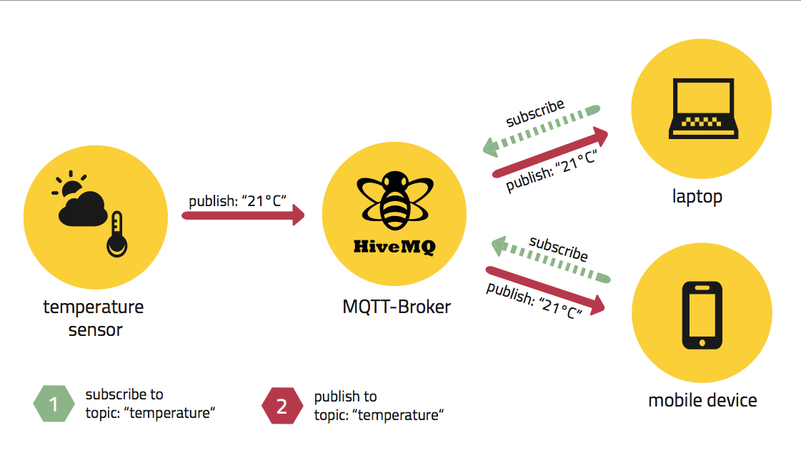
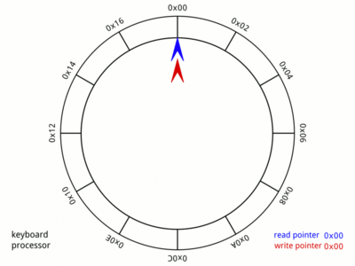
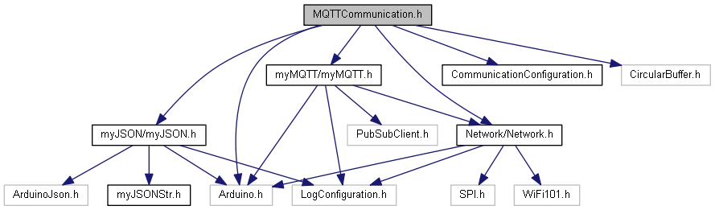
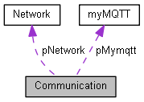

# SmartFactory_MQTTCommunication

The SmartFactroy_MQTTCommunication is an modular part of the SmartFactory Project.  
MQTTCommunication establishes a WLAN-Connection and allows you to connect  
with an MQTT-Broker to send and receive Message.  
Incomming Messages need to be in an kown JSON-Format and  will be convertet into a Struct.  
These Messages-Structs are stored in an Circular-Buffer.

<!-- add Pagebreak in Print: <div style="page-break-after: always;"></div> -->

## Table of Content
<!-- TOC Generated with https://magnetikonline.github.io/markdown-toc-generate/ -->
[TOC]

## The SmartFactory Project

[SmartFactory_MQTTCommunication](https://github.com/LMazzole/SmartFactory_MQTTCommunication) is part of the SmartFactory-Project. It provides a library with basic MQTT-Communication functions.

Other SmartFactory-Components are:
* [SmartFactory_Box-Sortic](<https://github.com/LMazzole/SmartFactory_Box-Sortic>)

A possible implementation of the SmartFactory-Project can be seen in the  Sortic-Showcase:


The associated  Repositorys are:  
  [SmartFactory-Sortic](https://github.com/LMazzole/SmartFactory-Sortic)  
  [SmartFactory_Box-Sortic](https://github.com/LMazzole/SmartFactory_Box-Sortic)  
  [SmartFactory_Vehicle-Sortic](https://github.com/LMazzole/SmartFactory_Vehicle-Sortic)  
  [SmartFactory_Vehicle-Basis](https://github.com/LMazzole/SmartFactory_Vehicle-Basis)  
  [SmartFactory_MQTTCommunication](https://github.com/LMazzole/SmartFactory_MQTTCommunication)  

## Tools and Technologies

The Source-code is written in C++.
To achieve this project, the following listed tools and technologies were used.

### Doxygen
Doxygen is used for the documentation of the sourcecode.  
An intorduction to *Doxygen* and how to install it can be found in the [ArdFSM-Repo](https://github.com/LMazzole/ArdFSM#documentation-with-doxygen).  

### VSCode PlatformIO
The used  IDE is [VSCode](https://code.visualstudio.com/) with the [PlatformIO](https://platformio.org/platformio-ide)-Extension.

### MQTT
MQTT (Message Queuing Telemetry Transport) is an lightweight  publish-subscribe messaging   protocol and requires a broker to relay the messages. It's used for M2M (machine-to-machine) communication.  
An MQTT-System always consist of a broker and one or multiple clients, which can be either subscriber or publisher. 

   

[Image: [MQTT101 - Eclispe Foundation](<https://www.eclipse.org/community/eclipse_newsletter/2014/october/article2.php>)]

A Client can subscribe and publish to one or multiple Topics. Topics are organized in a Tree similar to a Folder-structure in Windows. Here's an Example how such an Topic-Tree and published messages can look like:

 

This Images also illustrates well the scalability of MQTT.  
For more Infos about MQTT and MQTT-Topics check out the MQTT-Wiki on [Github](https://github.com/mqtt/mqtt.github.io/wiki).   
[Source: [Wiki:MQTT](https://en.wikipedia.org/wiki/MQTT), [MQTT](https://mqtt.org/) ]  

### Circular Buffer
A Circular Buffer or a Ring-Buffer uses an buffer with fixed Size. If the Buffer is full the oldest Element gets overwritten.

 

[Image: [Wiki: Circular buffer](https://en.wikipedia.org/wiki/Circular_buffer)]

# Documentation
## Hardware
This Code needs a WLAN-Shield to function properly.  
It's tested with an [Adafruit Feather M0 WiFi - ATSAMD21 + ATWINC1500](https://www.adafruit.com/product/3010) from Adafruit.

## Software
All functions and files are documented on the [GitHub-Page with Doxygen](https://lmazzole.github.io/SmartFactory_MQTTCommunication/)

### Dependency Graph


Extern Libraries:  
* [PubSubClient](https://pubsubclient.knolleary.net/)
* [WiFi101](https://www.arduino.cc/en/Reference/WiFi101)
* [ArduinoJson](https://arduinojson.org/)
* [CircularBuffer](https://github.com/rlogiacco/CircularBuffer)

### Collaboration Diagram



### Important Functions and Files

#### MQTTCommunication.h  
The *MQTTCommunication.h*-File serves as Interface.
It provides the functions for:
* Network-Connection
* MQTT-Functionalities
* access the Message-Storage (Cirrcular Buffer)

#### CommunicationConfiguration.h
In the *CommunicationConfiguration.h*-File are all important settings defined:
* WLAN SSID
* WLAN password
* WLAN Shield pins
* MQTT Broker IP
* JSON parse size
* Cirrcular Buffer size

#### myJSONStr.h
In the *myJSONStr.h*-File is defined how the JSON-Message and hence the struct looks like.

This is how the JSON-Message (received as String) can look like:
``` javascript
{
  "id": "hostname",
  "topic": "topic/topic",
  "status": "driving",
  "sector": "transit",
  "line": 1,
  "ack":"hostname",
  "req":"hostname",
  "cargo":"beer",
  "token":false;
  "error":false
}
```
And the corresponding Struct in which the message gets parsed:
``` cpp
struct myJSONStr {
    String id = "hostname";
    String topic = "topic/topic";
    String status = "driving";
    String sector = "transit";
    int line = 1;
    String ack = "hostname";
    String req = "hostname";
    String cargo = "beer";
    bool token = false;
    bool error = false;
};
```
## FAQ's
#### I'd like to use this code in my project. What do I need to know?  
> All you need to do is at the GitHub-Link to this Repo under *lib_deps* in your platformio.ini File and your good to go. All dependencies are downloaded automatic.

#### Where can I change the configurations like MQTT-Broker IP and WLAN-Credentials?  
> All the Configurationdata are stored in the *CommunicationConfiguration.h* file and can be edited there.

#### I'd like to change the incoming  JSON-Message. How can I do that?  
> Incoming Messages need to be in an know JSON-Format which is defined in* myJSONStr.h* and needs to match the implementation in *myJSON::parsingJSONToStruct*. If you would like to change this Format you need to adapt both files.


### ToDo's
The open ToDo's can be found in the Documentation on the [GitHub-Page](https://lmazzole.github.io/SmartFactory_MQTTCommunication/todo.html)
- [ ] Split the Code in 2 Repos: MQTTCommunication-Sortic and MQTTCommunication in order to increase reusability.

## Contributors
- [Luca Mazzoleni](https://github.com/LMazzole)
- Luciano Bettinaglio

## Changelog
V 1.0	-	Release BA FS19	-	[Luca Mazzoleni](https://github.com/LMazzole)

## License

[TODO]
